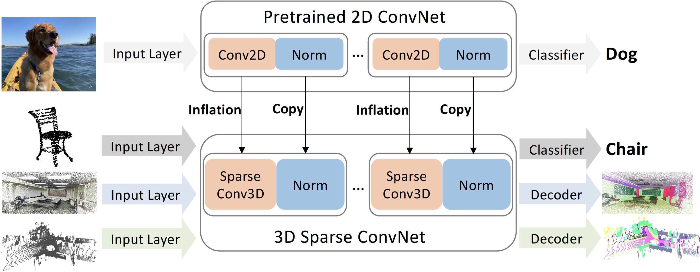

# Image2Point: 3D Point-Cloud Understanding with 2D Image Pretrained Models
Chenfeng Xu, Shijia Yang, Bohan Zhai, Bichen Wu, Xiangyu Yue, Wei Zhan, Peter Vajda, Kurt Keutzer, Masayoshi Tomizuka.

Our paper explores the potential of transferring 2D model architectures and weights to understand 3D point-clouds, by empirically investigating the feasibility of the transfer, the benefits of the transfer, and shedding light on why the transfer works. We discover that we can indeed use the same architecture and pretrained weights of a neural net model to understand both images and point-clouds. Specifically, we transfer the image-pretrained model to a point-cloud model by copying or inflating the weights. We find that finetuning the transformed image-pretrained models (FIP) with minimal efforts -- only on input, output, and normalization layers -- can achieve competitive performance on 3D point-cloud classification, beating a wide range of point-cloud models that adopt task-specific architectures and use a variety of tricks. When finetuning the whole model, the performance improves even further. Meanwhile, FIP improves data efficiency, reaching up to 10.0 top-1 accuracy percent on few-shot classification. It also speeds up the training of point-cloud models by up to 11.1x for a target accuracy (e.g., 90 % accuracy). Lastly, we provide an explanation of the image to point-cloud transfer from the aspect of neural collapse. The paper can be found at [Arxiv](https://arxiv.org/abs/2106.04180).


<p align="center">
    
</p>

If you find it helpful, please consider cite it as
## Citation
```
@article{xu2021image2point,
  title={Image2Point: 3D Point-Cloud Understanding with Pretrained 2D ConvNets},
  author={Xu, Chenfeng and Yang, Shijia and Zhai, Bohan and Wu, Bichen and Yue, Xiangyu and Zhan, Wei and Vajda, Peter and Keutzer, Kurt and Tomizuka, Masayoshi},
  journal={arXiv preprint arXiv:2106.04180},
  year={2021}
}
```
