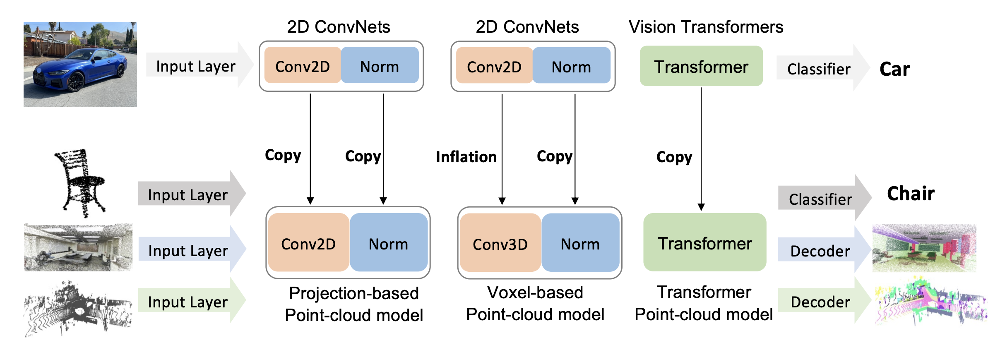

# Image2Point: 3D Point-Cloud Understanding with 2D Image Pretrained Models. (ECCV 2022)
By Chenfeng Xu*, Shijia Yang*, Tomer Galanti, Bichen Wu, Bohan Zhai, Xiangyu Yue, Wei Zhan, Peter Vajda, Kurt Keutzer, Masayoshi Tomizuka.

Our paper explores the potential of transferring 2D model architectures and weights to understand 3D point-clouds, by empirically investigating the feasibility of the transfer, the benefits of the transfer, and shedding light on why the transfer works. We discover that we can indeed use the same architecture and pretrained weights of a neural net model to understand both images and point-clouds. Specifically, we transfer the image-pretrained model to a point-cloud model by copying or inflating the weights. We find that finetuning the transformed image-pretrained models (FIP) with minimal efforts -- only on input, output, and normalization layers -- can achieve competitive performance on 3D point-cloud classification, beating a wide range of point-cloud models that adopt task-specific architectures and use a variety of tricks. When finetuning the whole model, the performance improves even further. Meanwhile, FIP improves data efficiency, reaching up to 10.0 top-1 accuracy percent on few-shot classification. It also speeds up the training of point-cloud models by up to 11.1x for a target accuracy (e.g., 90 % accuracy). Lastly, we provide an explanation of the image to point-cloud transfer from the aspect of neural collapse. The paper can be found at [Arxiv](https://arxiv.org/abs/2106.04180).

This repository contains a Pytorch implementation of Image2Point. The framework of our work can be found below:

<p align="center">
    
</p>

If you find it helpful, please consider cite it as

## Citation
```
@inproceedings{xu2022image2point,
  title={Image2Point: 3D Point-Cloud Understanding with 2D Image Pretrained Models},
  author={Xu, Chenfeng and Yang, Shijia and Galanti, Tomer and Wu, Bichen and Yue, Xiangyu and Zhai, Bohan and Zhan, Wei and Vajda, Peter and Keutzer, Kurt and Tomizuka, Masayoshi},
  booktitle={European Conference on Computer Vision},
  pages={638--656},
  year={2022},
  organization={Springer}
}
```

## License
**Image2Point** is released under the BSD license (See [LICENSE](https://github.com/chenfengxu714/image2point/blob/master/LICENSE) for details).


## Installation
The instructions are tested on Ubuntu 16.04 with python 3.7.5 and Pytorch 1.7.0 with GPU support.

* Clone the Image2Point repository:


```shell
git clone https://github.com/chenfengxu714/image2point.git
```

* Install [conda](https://docs.anaconda.com/anaconda/install/)

* Create an environment:

```shell
conda create --name i2p python=3.7.5
```

```shell
conda activate i2p
```

* Use conda to install required Python packages:


```shell
conda install pytorch=1.7 torchvision torchaudio cudatoolkit=10.2 -c pytorch
```

* Use pip to install required Python packages:

```shell
pip install -r requirements.txt
```
* Install [torchsparse](https://github.com/mit-han-lab/torchsparse) following its instruction.

* Make sure to install the 1.2.0 version of torchsparse:

```shell
pip install --upgrade git+https://github.com/mit-han-lab/torchsparse.git@v1.2.0
```

* ModelNet40 dataset can be downloaded [here](https://shapenet.cs.stanford.edu/media/modelnet40_ply_hdf5_2048.zip)
* S3DIS dataset can be downloaded [here](http://buildingparser.stanford.edu/dataset.html).
* SemanticKITTI dataset can be downloaded [here](http://semantic-kitti.org/dataset.html).

## Pretrained Models
Coming soon.

## Training
General command:
```shell
torchpack dist-run -np [num_of_gpus] python train.py configs/[dataset]/[config_name].yaml --run-dir [output_dir_name]
```

To train a model from scratch, use the following [dataset]/[config_name].yaml:
* modelnet/xx_from_scratch.yaml
* s3dis/from_scratch.yaml
* semantic_kitti/from_scratch.yaml

To train a model using pretrained 2D ConvNets, use the following [dataset]/[config_name].yaml:
* modelnet/xx_finetune.yaml
* s3dis/finetune.yaml
* semantic_kitti/finetune.yaml

To reproduce the semi-supervised learner experiment, first run few-shot setting on pretrained 2D ConvNets, then use the following:
* modelnet/34_distill.yaml

--run-dir is optional. Output directory name will be automatically generated if not set.

Config files follow the training recipe are reported in the paper. The following fields change as experiment varies:
* dataset.root: 
  * path where ModelNet40 *.h5 files are stored
  * path where S3DIS Area_1-6 directories are stored
  * path where SemanticKITTI sequence 00-21 directories are stored
* data.less_frame: enter a decimal to reduce the data, 1 for full data. This setting is not used in paper experiment, but convenient to have.
* data.few_shot: only for modelnet classification, 1, 5, 10 for 1, 5, 10 shots and none for full data.
* train.trainable_params: choose from io, ioms, iobn, all.
* train.pretrained_dir: not needed for training from scratch. Enter pretrained 2D model checkpoint path if training using pretrained 2D ConvNets. Entering none will automatically use pretrained ResNet on ImageNet-1K if train.pretrained is True.
* train.transformation: choose from x-axis, y-axis, or z-axis.
* scheduler.max_iter: only for polyLR scheduler. max_iter = num_epochs*iteration_per_epoch

We can monitor the training process using tensorboard.
```shell
tensorboard --logdir tensorboard/[output_dir_name]
```

## Evaluation
Coming soon.

## Credits
We referred to SPVNAS ([Paper](https://arxiv.org/abs/2007.16100), [Code](https://github.com/mit-han-lab/spvnas)) during our development. We thank the authors of SPVNAS for open-sourcing their code.
